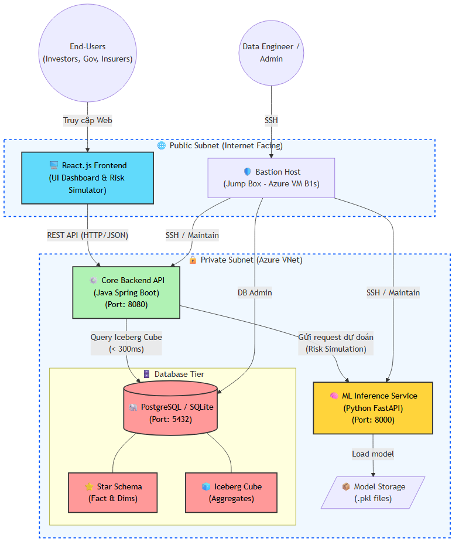
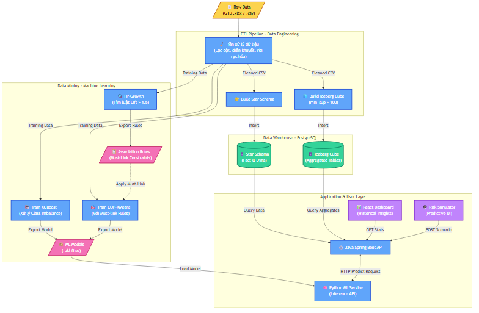
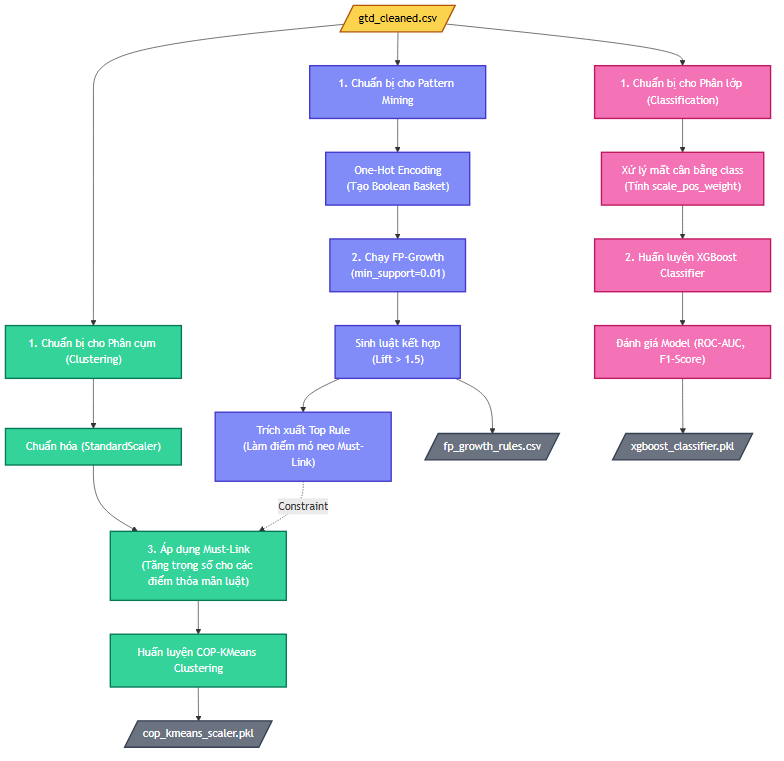

# 🌐 Global Security & Risk Intelligence Platform

Chào mừng đến với Repository chính thức của dự án **Global Security & Risk Intelligence Platform**.

Tài liệu này là bản đồ chỉ dẫn toàn diện, phản ánh chính xác 100% kiến trúc, công nghệ và luồng dữ liệu đã được triển khai trong thực tế (Từ Data Engineering, Data Science, Software Engineering cho đến Cloud Deployment).

---

## 🎯 1. Tầm Nhìn Sản Phẩm (Product Vision)

Dự án này là một **Sản phẩm tư vấn rủi ro an ninh** cấp doanh nghiệp, tận dụng nguồn dữ liệu khổng lồ từ Global Terrorism Database (GTD) với hơn 180,000 hồ sơ. Hệ thống giải quyết 2 bài toán lớn:

1. **Historical Insights (BI Dashboard):** Cung cấp cái nhìn trực quan về các khu vực rủi ro, xu hướng và phương thức tấn công thông qua hệ thống Data Warehouse và truy vấn siêu tốc từ Iceberg Cube (BUC).
2. **Predictive Intelligence (Risk Simulator):** Giả lập và dự báo tỷ lệ rủi ro (Risk Probability) cho các kịch bản đầu tư/xây dựng thông qua mô hình học máy (XGBoost) được tích hợp trực tiếp vào hệ thống.

---

## 🛠️ 2. Tech Stack Tiêu Chuẩn (Modern Technology Stack)

Dự án áp dụng kiến trúc Full-stack hiện đại, chia tách rõ ràng các service:

*   **Frontend (UI/UX):** React 19 + Vite, TailwindCSS (Giao diện chuẩn Corporate), Recharts (Biểu đồ động), React-Simple-Maps (Bản đồ nhiệt độ).
*   **Core Backend:** Java 21 LTS + Spring Boot 3.2. Đảm nhiệm việc giao tiếp với Database và điều phối API (N-Tier Architecture).
*   **ML Inference Service:** Python + FastAPI. Microservice chuyên biệt để load mô hình Machine Learning(`.pkl`) và phục vụ dự đoán.
*   **Data Mining & ETL:** Python (Pandas, Scikit-learn, Mlxtend, XGBoost).
*   **Database:** PostgreSQL (Mô hình Star Schema và Aggregated Iceberg Cube).
*   **Cloud Infrastructure:** Microsoft Azure (ClickOps Deployment, VNet Public/Private, Bastion Host, Blob Storage Static Web).

---

## 🏗️ 3. Kiến Trúc Hệ Thống (System Architecture)

Hệ thống được thiết kế theo chuẩn bảo mật **Zero-Trust** trên nền tảng Cloud:
- **Public Subnet:** Chứa React Web App (truy cập từ mọi nơi) và Bastion Host (Điểm vào duy nhất cho Admin).
- **Private Subnet:** Chứa Core Backend (Java), ML Service (FastAPI) và Database (PostgreSQL). Tuyệt đối cô lập khỏi Internet.



👉 Xem phân tích chi tiết tại: [System_Architecture_Diagram.md](data/processed/System_Architecture_Diagram.md)

---

## 📊 4. Đường Ống Dữ Liệu (Data Pipeline & ETL)

Toàn bộ quá trình biến đổi dữ liệu thô thành dữ liệu phục vụ báo cáo siêu tốc được chia làm 3 giai đoạn (Phase):

1. **ETL Phase 1 - Data Cleaning:** Lọc 50 cột cốt lõi, xử lý Missing Values, rời rạc hóa (Binning) tọa độ Lat/Lon và cấp độ thương vong. [*(Xem sơ đồ)*](data/processed/ETL_Phase1_Data_Cleaning.mmd)
2. **ETL Phase 2 - Data Warehouse:** Ánh xạ dữ liệu sạch vào hệ cơ sở dữ liệu dạng sao (Star Schema) với bảng `fact_events` và 5 bảng chiều (Dimensions). [*(Xem sơ đồ)*](data/processed/ETL_Phase2_Data_Warehouse.mmd)
3. **ETL Phase 3 - Iceberg Cube:** Áp dụng thuật toán **BUC (Bottom-Up Computation)** để tính toán trước mọi tổ hợp có thể xảy ra (hỗ trợ `min_sup=20` để chống lại Curse of Dimensionality). [*(Xem sơ đồ)*](data/processed/ETL_Phase3_Iceberg_Cube.mmd)



👉 Xem phân tích chi tiết tại: [data_flow_diagram.md](data/processed/data_flow_diagram.md)

---

## 🧠 5. Khai Phá Dữ Liệu (Data Mining Pipeline)

Hệ thống ứng dụng sự kết hợp độc đáo giữa Học có giám sát (Supervised) và Học bán giám sát (Semi-supervised):

*   **FP-Growth:** Tìm kiếm các luật kết hợp (Association Rules) ẩn sâu trong lịch sử khủng bố (với `min_support=0.01`, `Lift > 1.5`).
*   **XGBoost Classifier:** Huấn luyện mô hình cây quyết định Gradient Boosting (có xử lý Class Imbalance) để dự đoán khả năng thành công của một vụ tấn công.
*   **COP-KMeans (Constrained KMeans):** Sử dụng các luật sinh ra từ FP-Growth làm **Must-link Constraints** để cải thiện độ chính xác cho mô hình phân cụm.



👉 Xem phân tích chi tiết tại: [Data_Mining_Pipeline.mmd](data/processed/Data_Mining_Pipeline.mmd)

---

## 📂 6. Cấu Trúc Thư Mục (Project Structure)

```text
📦 Data_Mining_Final
 ┣ 📂 backend/core-api/ # Core API viết bằng Java Spring Boot (Port 8080)
 ┣ 📂 data/             # Dữ liệu
 ┃ ┣ 📂 raw/            # Dữ liệu gốc chưa qua xử lý
 ┃ ┗ 📂 processed/      # Hình ảnh sơ đồ kiến trúc (.png, .mmd), dữ liệu sạch
 ┣ 📂 etl/              # Script Python xây dựng Data Warehouse và BUC Cube
 ┣ 📂 frontend/         # Ứng dụng Web Client React/Vite
 ┣ 📂 ml/               # Script huấn luyện ML (FPGrowth, XGBoost, KMeans)
 ┃ ┗ 📂 models/         # Nơi lưu mô hình .pkl đã train
 ┣ 📂 ml_service/       # API Inference bằng FastAPI (Port 8000)
 ┣ 📜 start_all.ps1     # Script khởi động tự động toàn bộ hệ thống (Local)
 ┗ 📜 README.md         # Document tổng quan bạn đang đọc
```

---

## 🚀 7. Hướng Dẫn Chạy Dự Án (Local Development)

Dự án đã được tích hợp sẵn Script khởi động 1-click cho môi trường Windows.

1. **Chuẩn bị môi trường:** 
   - Đảm bảo máy tính đã cài đặt: `Java 21`, `Maven`, `Python 3.10+`, `Node.js 20+`.
   - Cấu hình file `.env` hoặc cập nhật đường dẫn `JAVA_HOME` trong `start_all.ps1`.
2. **Khởi động 1-click:**
   Mở PowerShell (Run as Administrator) và chạy:
   ```powershell
   .\start_all.ps1
   ```
   Script này sẽ tự động: Kích hoạt môi trường Python -> Chạy ML Service -> Compile và chạy Java Spring Boot -> Cài đặt npm và mở Frontend Web ở `http://localhost:5173`.

---
*Developed with ❤️ by the Global Security Data Team.*
