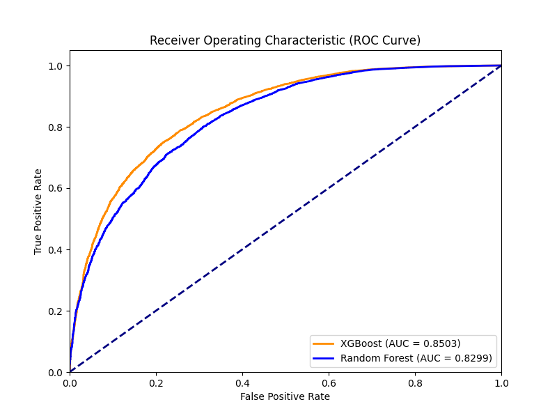
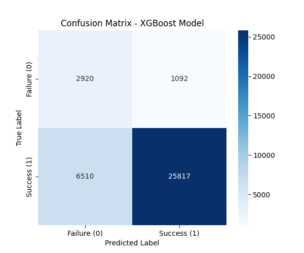

# 📊 BÁO CÁO ĐÁNH GIÁ MÔ HÌNH MACHINE LEARNING (AUTOMATED)

Báo cáo được tự động tạo từ script `03_data_mining.py` sau quá trình huấn luyện mô hình.

## 1. So sánh Mô hình (Baseline Comparison)
| Model | Accuracy | Precision | Recall | F1-Score | ROC-AUC |
|-------|----------|-----------|--------|----------|---------|
| **XGBoost (Advanced)** | 0.7908 | 0.9594 | 0.7986 | 0.8717 | **0.8503** |
| **Random Forest (Baseline)** | 0.8300 | 0.9480 | 0.8558 | 0.8995 | 0.8299 |

## 2. Biểu đồ ROC Curve
Biểu đồ so sánh đường cong ROC giữa XGBoost và thuật toán Baseline (Random Forest):

## 3. Ma trận nhầm lẫn (Confusion Matrix)
Ma trận nhầm lẫn của mô hình XGBoost tốt nhất trên tập Test, cho thấy tỷ lệ False Positive và False Negative:

