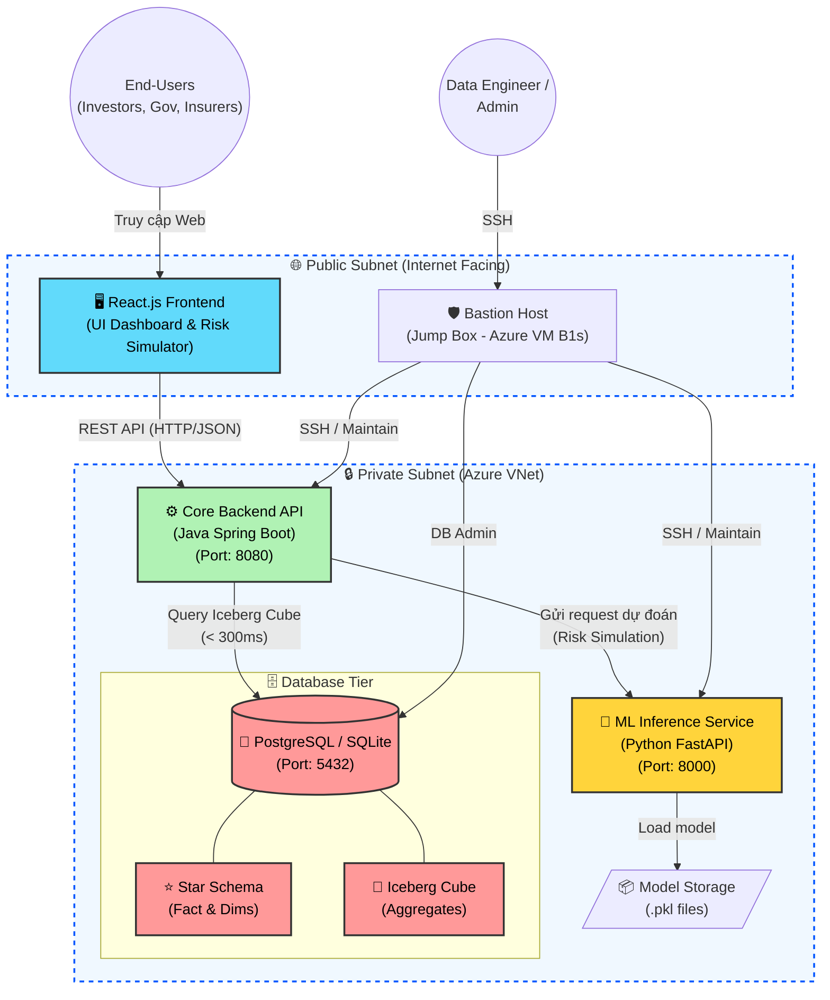

# Sơ đồ Kiến trúc Hệ thống (System Architecture Diagram)

Sơ đồ dưới đây mô tả luồng giao tiếp và kiến trúc tổng thể của dự án **Global Security & Risk Intelligence Platform** dựa trên định hướng kỹ thuật (TAD). Bạn có thể copy đoạn code Mermaid này bỏ vào các công cụ như [Mermaid Live Editor](https://mermaid.live/) hoặc chèn trực tiếp vào báo cáo (nếu dùng Markdown) để hiển thị hình ảnh.

### Chú thích luồng dữ liệu:
1. **Luồng Khám phá lịch sử (Historical Insights):** User tương tác với `React.js Frontend` -> Gọi API `Core Backend` -> Core Backend query thẳng vào `Iceberg Cube` trong Database để lấy dữ liệu đã được tính toán sẵn siêu nhanh.
2. **Luồng Dự báo rủi ro (Predictive Intelligence):** User nhập kịch bản -> `Frontend` gọi `Core Backend` -> `Core Backend` gọi nội bộ sang `ML Inference Service` qua HTTP REST -> FastAPI load mô hình XGBoost `.pkl` để dự đoán và trả kết quả ngược lại.
3. **Bảo mật:** Toàn bộ Database, Core Backend và ML Service đều nằm trong Private Subnet, không mở port ra ngoài Internet. Muốn truy cập bảo trì phải thông qua `Bastion Host`.
