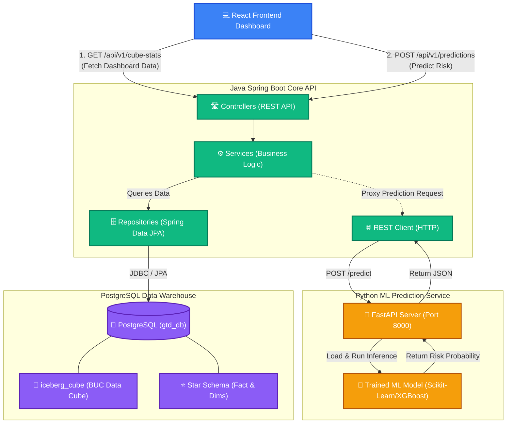
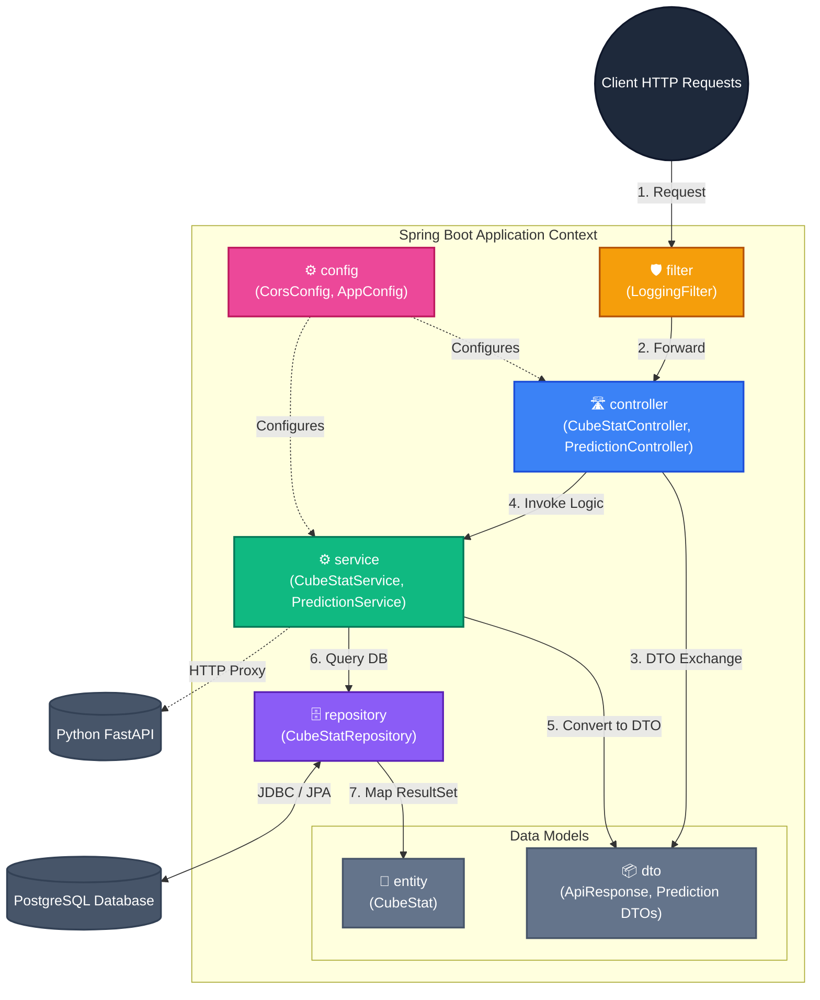

# GTD System & Backend Architecture

This document contains two diagrams:
1. **System Integration Diagram**: Shows how the Frontend, Backend, ML Service, and Database interact.
2. **Backend N-Tier Architecture**: Dives deep into the Java Spring Boot source code structure.

---

## 1. System Integration Diagram

---

## 2. Java Spring Boot N-Tier Architecture (Core API)

## Architecture Layers Explained

1. **`config` (Configuration Layer)**: Contains Spring configuration classes such as CORS setup, WebMvc config, and Bean definitions (like `RestTemplate` for calling the ML service).
2. **`filter` (Security & Middleware Layer)**: Intercepts incoming HTTP requests before they reach the controllers. Used for request logging (`LoggingFilter`), authentication, and input sanitization.
3. **`controller` (Presentation Layer)**: Exposes RESTful API endpoints. Responsible for validating incoming HTTP requests, mapping them to DTOs, and routing them to the appropriate Service.
4. **`service` (Business Logic Layer)**: Contains the core business rules. It orchestrates data flow, applies transformations, interacts with external ML APIs, and handles transactions.
5. **`repository` (Data Access Layer)**: Interfaces with the PostgreSQL database using Spring Data JPA. Abstracts away raw SQL queries into method names and handles object-relational mapping.
6. **`dto` & `entity` (Data Models)**: 
   - **Entity**: Java classes directly mapped to database tables (e.g., `iceberg_cube`).
   - **DTO (Data Transfer Object)**: Safe objects used to transfer data over the network to the client (e.g., `ApiResponse`), ensuring database structures aren't directly exposed.
