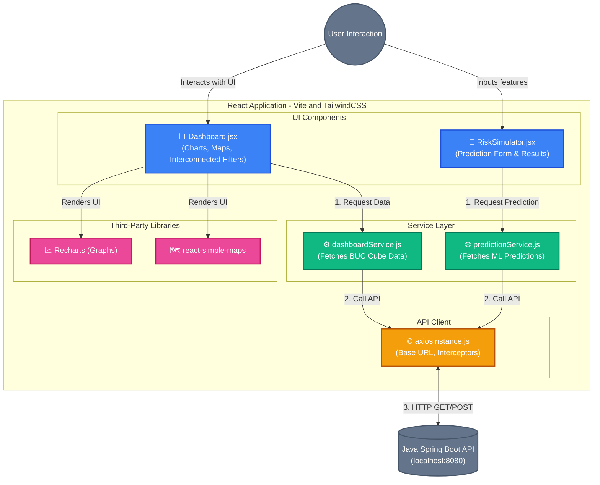

# GTD React Frontend Architecture

This document outlines the architecture of the React + Vite frontend application. It follows a modular structure separating UI components from business logic and API communication.

## Architecture Layers Explained

1. **`components` (Presentation Layer)**:
   - Contains React functional components (`Dashboard.jsx`, `RiskSimulator.jsx`).
   - Manages local state (e.g., filter values, loading indicators, interconnected dropdowns).
   - Uses TailwindCSS for styling and external libraries (Recharts, react-simple-maps) to visualize data.
2. **`services` (Business/Logic Layer)**:
   - Acts as a bridge between UI components and the API.
   - Decouples API calling logic from the React components. For example, `dashboardService.js` handles all endpoints related to Data Cube statistics.
3. **`api` (HTTP Client Layer)**:
   - A centralized Axios instance configured with the Base URL (e.g., `VITE_API_BASE_URL`).
   - Essential for handling CORS, Authorization headers (if added later), and global error handling/interceptors.
4. **Third-Party Integrations**:
   - **TailwindCSS**: Provides utility-first styling for the entire application.
   - **Recharts**: Used for rendering dynamic, responsive SVGs like Trend lines and Bar charts.
   - **React-Simple-Maps**: Used for rendering the global choropleth map.
